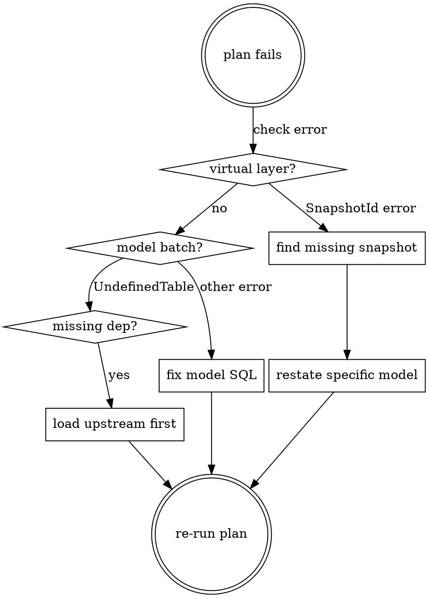

# SQLMesh Skill (maintenance only)

> **Migration notice:** SQLMesh is being phased out -- the active analytics project is `datalake/` (dbt). Use this skill for bug fixes and operational support of existing models only. Do not propose new SQLMesh models.

> **Read `sqlmesh/README.md` first.** It is the single source of truth for architecture, conventions, and patterns.

## Architecture Overview

Single-model-per-concept across three zones:

- **raw_zone**: Flat extractions from live PG tables and external sources. No complex joins.
- **trusted_zone**: Enrichment, aggregation, geocoding. Source of truth for the pipeline.
- **refined_zone**: Pre-aggregated models for BI, API, observatory. Sources only from trusted_zone.

Each model is a single `INCREMENTAL_BY_TIME_RANGE` (no yearly splits, no UNION ALL views).

## Key Rules

- **Filter on `start_datetime` (UTC)**, never on `start_datetime_tz`
- **Use `@start_ts` / `@end_ts`** for timestamp filters, never `@start_ds` / `@end_ds`
- **Use `@create_indexes()` macro** as single post-statement (after the query `;`) -- creates indexes only at snapshot creation, not per batch
- **Never use raw `CREATE INDEX`** as post-statements -- causes deadlocks with concurrent batches
- **Never use `CREATE INDEX CONCURRENTLY`** -- cannot run inside transactions
- **Model `start` must include timezone offset** (`+0100` for winter boundaries)
- **Always set `cron`** on materialised models to control execution frequency
- **No INTERVAL padding** on time boundaries -- `@start_ts`/`@end_ts` are exact
- File name must match model name in `MODEL` block
- **No Jinja macros** -- write SQL directly in models. Python `@macro()` functions in `macros/` exist for shared patterns (perimeter joins, temp tables)
- **No LATERAL joins** -- use pre-aggregated CTEs with regular LEFT JOINs

## PostgreSQL Live Tables (data sources for raw_zone)

```
carpool_v2.carpools          # Core journey data
carpool_v2.geo               # Geographic data (start/end geo_code)
carpool_v2.status            # Acquisition status
carpool_v2.operator_incentives # Operator-paid incentives
policy.incentives            # RPC campaign incentives (v2)
carpool.carpools             # Legacy v1 carpools (for CEE joins)
operator.operators           # Operator metadata
company.companies            # Company info (SIRET)
cee.cee_applications         # CEE applications
```

## Python Utilities

| Module | Purpose |
|--------|---------|
| `utils/loading.py` | Load CSV, Excel, Parquet, GeoPackage |
| `utils/cleaning.py` | Column normalization, type casting |
| `utils/s3.py` | S3 client initialization |
| `utils/url.py` | URL helpers for perimeter data |

## Model Creation Patterns

### SQL Model Template

```sql
MODEL (
  name schema_name.model_name,
  kind INCREMENTAL_BY_TIME_RANGE (
    time_column start_datetime,
    batch_size 30,
  ),
  start '2020-01-01 00:00:00+0100',
  cron '@daily',
  grain (_id),
  tags ('zone_name', 'domain'),
);

SELECT
  ...
FROM source_table
WHERE start_datetime >= @start_ts
  AND start_datetime < @end_ts;

CREATE INDEX IF NOT EXISTS model_name_id_index
  ON schema_name.model_name (_id);
CREATE INDEX IF NOT EXISTS model_name_start_datetime_index
  ON schema_name.model_name (start_datetime);
```

### Index Conventions

Use the `@create_indexes()` macro as a single post-statement after the query `;`.
It only runs during snapshot creation (`runtime_stage == "creating"`), not during
batch inserts. This prevents deadlocks when `concurrent_tasks > 1`.

```sql
@create_indexes(
  'idx_name ON schema.model (col)',
  'idx_multi ON schema.model (col1, col2)',
  'UNIQUE uq_name ON schema.model (col1, col2)',
  'idx_gist ON schema.model USING GIST (geom)',
);
```

Rules:
- One `@create_indexes()` call per model with all indexes as arguments
- Prefix with `UNIQUE` for unique indexes
- Include `USING GIST` for spatial indexes
- Never use raw `CREATE INDEX` -- causes deadlocks with concurrent batches
- Never use `CONCURRENTLY` -- cannot run inside transactions
- SQLMesh resolves logical model names to physical snapshot tables automatically

### Cron Configuration

Every materialised model must have a `cron` property. Without it, the model is eligible
for execution on every `sqlmesh run`, which wastes resources.

| Frequency | Syntax | Use for |
|-----------|--------|---------|
| Daily | `@daily` | Journeys, incentives, daily aggregates |
| Monthly | `@monthly` | Monthly aggregates (obs_directions_month, insee_counters) |
| Quarterly | `0 0 1 1,4,7,10 *` | Quarterly aggregates |
| Biannual | `0 0 1 1,7 *` | Semester aggregates |
| Yearly | `@yearly` | Year aggregates, reference data (perimeters, AOM) |

SQLMesh uses the `croniter` library. Supported presets: `@daily`, `@weekly`, `@monthly`,
`@yearly` (or `@annually`), `@hourly`. Standard 5-field cron syntax also works.

### Time Boundaries

No INTERVAL padding needed. The `time_column` in the MODEL block must match the column
used in the WHERE clause. SQLMesh calculates exact boundaries.

```sql
-- Correct: no padding, time_column = start_datetime
WHERE start_datetime >= @start_ts
  AND start_datetime < @end_ts

-- Wrong: unnecessary padding
WHERE start_datetime >= @start_ts::timestamp - INTERVAL '1 day'

-- Wrong: filtering on timezone-adjusted column
WHERE start_datetime_tz >= @start_ts
```

Exception: `lookback` in the MODEL block handles overlap for late-arriving data:

```sql
kind INCREMENTAL_BY_TIME_RANGE (
  time_column datetime,
  lookback 3,    -- re-process 3 extra intervals before @start_ts
  batch_size 30,
),
```

### Pre-aggregated CTEs (replacing LATERAL joins)

LATERAL joins scale linearly with row count and stall on large datasets.
Always pre-aggregate into CTEs, then LEFT JOIN.

```sql
-- Wrong: LATERAL join (O(n) subqueries)
LEFT JOIN LATERAL (
  SELECT array_agg(amount) FROM incentives WHERE carpool_id = j._id
) AS inc ON TRUE

-- Correct: pre-aggregated CTE
WITH incentives_agg AS (
  SELECT carpool_id, array_agg(amount) AS amounts
  FROM raw_zone.incentives
  WHERE datetime >= @start_ts AND datetime < @end_ts
  GROUP BY carpool_id
)
SELECT ...
FROM raw_zone.journeys j
LEFT JOIN incentives_agg inc ON inc.carpool_id = j._id
WHERE j.start_datetime >= @start_ts AND j.start_datetime < @end_ts
```

### Timezone Handling (overseas territories)

Use the `@get_timezoned_timestamp()` macro to convert UTC timestamps to local time
based on the commune geo_code:

```sql
@get_timezoned_timestamp(geo_code_col, datetime_col) AS start_datetime_tz
```

The macro handles Guadeloupe/Martinique (971-972), Guyane (973), Reunion (974),
Mayotte (976), and defaults to Europe/Paris. It returns a raw SQL CASE expression.

### Transitory Models (observatoire)

Pre-computed models that avoid repeated expensive operations:

- `refined_zone.obs_journeys_incentives` -- siret classification per journey
  (eliminates LATERAL unnest from obs_directions_day and obs_od_day)
- `refined_zone.obs_journeys_geo` -- geographic dimensions per journey
  (eliminates perimeters DISTINCT ON lookups from obs_directions_* models)

---

## Production Workflow

### Concepts

- **`sqlmesh plan`** = change management / deployment (creates snapshots, backfills)
- **`sqlmesh run`** = scheduled execution (processes missing intervals based on cron)
- SQLMesh decides what to run based on: dependencies, missing intervals, stored state, model cron

### Development Cycle

1. Modify model(s)
2. `sqlmesh plan dev` -- review diff, impacts, intervals
3. Test / audit in dev environment
4. `sqlmesh plan` -- promote to prod (creates new snapshots)
5. `sqlmesh run` -- scheduled execution fills missing intervals

### Production Cron

Configure **one external cronjob** for the entire project:

```cron
*/5 * * * * cd /opt/sqlmesh && sqlmesh run >> /var/log/sqlmesh/run.log 2>&1
```

Each model's `cron` property controls its actual execution frequency.
The external cron just needs to run at least as often as the most frequent model.

### Key Commands

```bash
# Development
sqlmesh plan dev                    # Preview changes in dev
sqlmesh plan dev --auto-apply       # Apply changes automatically
sqlmesh render model_name           # Check rendered SQL

# Production
sqlmesh plan                        # Deploy to prod
sqlmesh run                         # Execute missing intervals

# Debugging / repair
sqlmesh run --select-model model    # Run specific model only
sqlmesh plan --restate-model model  # Force reprocess a model

# Queries
sqlmesh fetchdf "SELECT ..."        # Run SQL query
```

### --select-model

Almost never use in production. Let `sqlmesh run` evaluate the full DAG.
Reserve `--select-model` for:

- Debugging a specific model
- Targeted backfill
- Repairing a broken model

Using it in production can leave downstream models stale.

---

## Debugging SQLMesh Plans

### Virtual Layer: The #1 Source of Failures

The virtual layer update creates/swaps views for ALL models in the project,
regardless of `--select-model`. It runs only after all model batches succeed.

A missing snapshot table for ANY model blocks the entire plan.

### Diagnosing Virtual Layer Failures

```
Error: Execution failed for node SnapshotId<"db"."schema"."model": 1234567890>
```

This means SQLMesh tried to create a view pointing to a snapshot table that does not exist.

```sql
-- Check if the snapshot table exists
SELECT tablename FROM pg_tables
WHERE schemaname = 'raw_zone' AND tablename LIKE 'model_name%';
```

### Fixing Missing Snapshot Tables

Materialise the specific missing model:

```bash
sqlmesh plan --restate-model 'schema.missing_model' --select-model 'schema.missing_model' --auto-apply
```

Then re-run your original plan. Repeat until the virtual layer passes.

### Reference Data Loading Order

When starting from scratch, load models in dependency order:

1. **Raw reference loaders** (Python models): perimeters, INSEE, IGN, CEREMA
2. **Trusted geo models**: com_evolution, perimeters, perimeters_agg, aom_region
3. **Raw data models**: journeys, incentives, operator_incentives, cee_applications
4. **Trusted data models**: journeys, campaigns, insee_counters, cee
5. **Refined models**: observatory, exports, partners

Use `--select-model` with tags or specific models to load in stages:

```bash
sqlmesh plan dev --select-model 'raw_zone.old_perimeters_*' --auto-apply
```

### Common Errors

| Error | Cause | Fix |
|-------|-------|-----|
| `Execution failed for node SnapshotId<...>` | Missing snapshot table | `--restate-model` the specific model |
| `UNION types X and Y cannot be matched` | Enum type vs varchar | Cast to common type (VARCHAR) |
| `UndefinedTable: relation "..." does not exist` | Dependency not materialised | Load upstream model first |
| `CREATE INDEX CONCURRENTLY cannot run inside a transaction` | CONCURRENTLY in post-statement | Remove CONCURRENTLY keyword |
| `--restate-model` does not pick up schema changes | Reuses old snapshot definition | Run plain `sqlmesh plan` instead |

### Workflow: Debugging a Failed Plan


