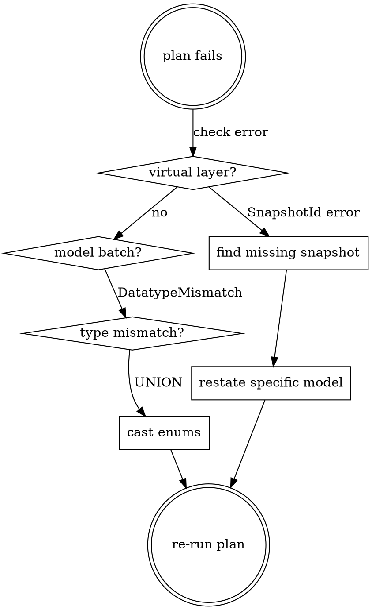

# SQLMesh Skill

> **Read `sqlmesh/README.md` first.** It is the single source of truth for architecture, conventions, macros, and patterns.

## Key Rules (reminders — README is canonical)

- **Filter on `start_datetime` (UTC)**, never on `start_datetime_tz`
- **Use `@start_ts` / `@end_ts`** for timestamp filters, never `@start_ds` / `@end_ds`
- **Use `@create_index()`** macro, never raw `CREATE INDEX`
- **Model `start`/`end` must include timezone offset** (`+0100` for winter boundaries)
- File name must match model name in `MODEL` block

## PostgreSQL Live Tables (data sources for raw_zone)

```
carpool_v2.carpools          # Core journey data
carpool_v2.geo               # Geographic data
carpool_v2.status            # Acquisition status
policy.incentives            # Incentive data
operator.operators           # Operator metadata
company.companies            # Company info (SIRET)
```

## Python Utilities

| Module | Purpose |
|--------|---------|
| `utils/loading.py` | Load CSV, Excel, Parquet, GeoPackage |
| `utils/cleaning.py` | Column normalization, type casting |
| `utils/s3.py` | S3 client initialization |
| `utils/url.py` | URL helpers for perimeter data |

## Verification Workflow

After any model change, always run:

```bash
cd sqlmesh

# 1. Check the rendered SQL is correct
sqlmesh render <model_name>

# 2. Preview the plan (never auto-apply without review)
sqlmesh plan dev
```

For production: `sqlmesh plan` (no env suffix).

## Quick Setup

```bash
cd sqlmesh
uv sync
cp .env.example .env  # edit with local credentials
```

## Model Creation Patterns

### SQL Model Template

```sql
MODEL (
  name schema_name.model_name,
  kind INCREMENTAL_BY_TIME_RANGE (
    time_column start_datetime,
    lookback 7,
    batch_size 30,
  ),
  start '2020-01-01',
  cron '@daily',
  grain (_id),
  tags ('zone_name'),
);

SELECT
  ...
FROM trusted_zone.journeys
WHERE valid_acquisition_status = true
  AND start_datetime BETWEEN @start_ts AND @end_ts
```

### Key Conventions

- Use `@start_ts` / `@end_ts` for timestamp filters (never `@start_ds` / `@end_ds`)
- Filter on `start_datetime` (UTC), never `start_datetime_tz`
- Use `@create_index()` macro for indexes, never raw `CREATE INDEX`
- File name must match model name in `MODEL` block
- `trusted_zone.journeys` is the standard base for refined models

---

# Debugging SQLMesh Plans

## Overview

SQLMesh plan failures cascade in non-obvious ways. The virtual layer update runs AFTER all model batches and touches ALL models — not just selected ones. A single missing snapshot table blocks the entire plan.

## Virtual Layer: The #1 Source of Failures

The virtual layer update creates/swaps views for ALL models in the project, regardless of `--select-model`. It runs only after all model batches succeed.

**Consequence:** A missing snapshot table for ANY model (even one you didn't select) blocks the entire plan.

### Diagnosing Virtual Layer Failures

```
Error: Execution failed for node SnapshotId<"db"."schema"."model": 1234567890>
```

This means SQLMesh tried to create a view pointing to a snapshot table that doesn't exist.

**Inspection (via DuckDB MCP or fetchdf):**

```sql
-- Check if the snapshot table exists
SELECT tablename FROM pg_tables
WHERE schemaname = 'raw_zone' AND tablename LIKE 'model_name%';

-- Check what views exist
SELECT viewname, definition FROM pg_views
WHERE schemaname = 'raw_zone' AND viewname = 'model_name';
```

### Fixing Missing Snapshot Tables

Materialize the specific missing model:

```bash
sqlmesh plan --restate-model 'schema.missing_model' --select-model 'schema.missing_model' --auto-apply
```

Then re-run your original plan. Repeat until the virtual layer passes all models.

## Type Mismatches in UNION Views

### Enum vs VARCHAR

Live PostgreSQL tables use custom enum types (`policy.incentive_status_enum`). UNION views mixing enum and varchar fail:

```
UNION types character varying and policy.incentive_status_enum cannot be matched
```

**Fix:** Cast enum columns to `VARCHAR` in the macro and the UNION view:

```sql
-- In the macro querying live PG tables:
pi.status::VARCHAR AS status,
pi.state::VARCHAR AS state

-- In the UNION view (belt-and-suspenders):
status::VARCHAR AS status,
state::VARCHAR AS state
```

## `--restate-model` Does NOT Pick Up Schema Changes

`--restate-model` reuses the existing snapshot definition. If you changed the model SQL (added casts, renamed columns), the old snapshot definition is still used.

**Fix:** Run a plain `sqlmesh plan` (without `--restate-model`) so SQLMesh detects the model as "Directly Modified" and creates a new snapshot with the updated definition.

## Quick Reference: Common Errors

| Error | Cause | Fix |
|-------|-------|-----|
| `Execution failed for node SnapshotId<...>` | Missing snapshot table | `--restate-model` the specific model |
| `UNION types X and Y cannot be matched` | Enum type vs varchar | Cast to common type (VARCHAR) |
| `print() got unexpected keyword argument 'exc_info'` | `exc_info` is `logging`, not `print` | Use `print(str(e))` or `logging.error(..., exc_info=True)` |
| `cannot drop table X because other objects depend on it` | View depends on snapshot table being replaced | Don't restate models that already have working views |

## Workflow: Debugging a Failed `sqlmesh plan`


