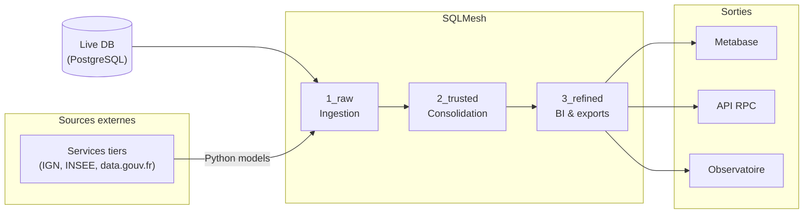

# RPC Data Warehouse

Le Data Warehouse de Preuve de Covoiturage (RPC) est une solution de gestion et d'analyse des données conçue pour stocker, organiser et interroger efficacement les données liées aux activités de covoiturage. Il utilise SQLMesh, un framework de gestion de modèles SQL, pour structurer et orchestrer les transformations de données.

- [Documentation de SQLMesh](https://sqlmesh.readthedocs.io/en/stable/)

## Installation

SQLMesh est une librairie Python. Elle nécessite un environnement virtuel (venv) et l'installation de quelques dépendances.

Le shell Nix à la racine du monorepo fournit les outils partagés (`python`, `uv`, `direnv`...). L'environnement virtuel propre au dossier `sqlmesh/` est créé et activé automatiquement par `direnv` à l'entrée du dossier (`.envrc` -> `uv sync` -> `source .venv/bin/activate`).

```shell
nix develop                # outils partagés + direnv
direnv allow .             # une fois à la racine
cd ./sqlmesh && direnv allow .   # une fois ici, puis automatique
```

**Installation manuelle (sans direnv)**

Prérequis : installer [Python](https://www.python.org/downloads/) et [uv](https://docs.astral.sh/uv/).

```shell
cd ./sqlmesh
uv venv
uv sync
source .venv/bin/activate
```

## Configuration

Copier `.env.example` et modifier le fichier `.env`.

```shell
cp .env.example .env
```

## Architecture en zones

Les données sont organisées en 3 zones. Les modèles SQL sont définis dans `models/`, chaque zone dans son propre sous-dossier. L'organisation des dossiers n'influe pas sur les dépendances entre modèles, qui sont définies dans chacun d'eux.

Chaque concept métier est un modèle unique `INCREMENTAL_BY_TIME_RANGE` (pas de découpage annuel ni de vues UNION ALL).

### Cycle de la donnée



### 1_raw -- Ingestion

- Charge les données **externes** (IGN, INSEE, data.gouv.fr...) via des modèles Python
- Charge les données RPC **directement depuis la base live** (PostgreSQL, gateway par défaut)
- Extractions plates : trajets, incitations opérateur, incitations RPC, données géo sont ingérés séparément
- Pas de jointures complexes, pas de LATERAL
- Crée les index nécessaires aux jointures des zones suivantes

### 2_trusted -- Consolidation

- Source de vérité pour l'ensemble du pipeline
- Effectue les jointures d'enrichissement (géo, politiques, opérateurs...)
- Utilise des CTEs pré-agrégées plutôt que des jointures LATERAL
- Crée les index pour l'exploitation
- Gateway postgres (défaut)

### 3_refined -- BI & exports

- Modèles de sortie : Metabase, exports API, observatoire
- Données pré-agrégées pour les besoins métier
- Se base **uniquement sur 2_trusted**
- Gateway postgres (défaut)

## Conventions

### Nommage des fichiers

Le nom du fichier doit correspondre exactement au nom du modèle défini dans le bloc `MODEL`. SQLMesh utilise ce nom pour résoudre les dépendances entre modèles -- une incohérence provoque des erreurs silencieuses.

```
models/2_trusted_zone/journeys/journeys.sql  ->  name trusted_zone.journeys
models/1_raw_zone/cee/cee_applications.sql   ->  name raw_zone.cee_applications
```

Le préfixe numérique du dossier (`1_raw_zone/`) est une convention de lisibilité uniquement : il n'est pas reflété dans le nom du modèle.

### Index

Utiliser la macro `@create_indexes()` comme post-statement après le `;` de la requête. Elle crée les index uniquement lors de la création du snapshot (pas à chaque batch), ce qui évite les deadlocks quand `concurrent_tasks > 1`.

```sql
SELECT ... FROM source WHERE ...;

@create_indexes(
  'model_name_id_index ON schema_name.model_name (_id)',
  'model_name_col_index ON schema_name.model_name (column_name)',
);
```

SQLMesh résout automatiquement les noms logiques vers les tables physiques (snapshots).

Pour les index spatiaux, inclure `USING GIST` :

```sql
@create_indexes(
  'perimeters_geom_index ON trusted_zone.perimeters USING GIST (geom)',
);
```

Pour les index uniques, préfixer avec `UNIQUE` :

```sql
@create_indexes(
  'UNIQUE uq_insee_counters_id ON trusted_zone.insee_counters (_id)',
);
```

Ne jamais utiliser `CONCURRENTLY` -- SQLMesh exécute dans une transaction. Ne jamais utiliser de `CREATE INDEX` SQL brut -- cela provoque des deadlocks avec les batches concurrents.

### Cron

Chaque modèle matérialisé doit définir un `cron` pour contrôler sa fréquence d'exécution. Sans `cron`, le modèle s'exécute à chaque `sqlmesh run`.

| Fréquence | Syntaxe | Exemples |
|-----------|---------|----------|
| Quotidien | `@daily` | journeys, incentives, operator_incentives |
| Hebdomadaire | `@weekly` | campaigns (chargeur API « latest ») |
| Mensuel | `@monthly` | insee_counters |
| Annuel | `@yearly` | périmètres millésimés (IGN, CEREMA, INSEE) |

SQLMesh utilise la librairie `croniter`. Presets supportés : `@daily`, `@weekly`, `@monthly`, `@yearly` (ou `@annually`), `@hourly`. La syntaxe cron standard à 5 champs fonctionne également (ex. `0 0 1 1,4,7,10 *` pour un modèle trimestriel).

### Timezones et variables de batch

SQLMesh expose deux familles de variables pour les bornes temporelles des batches incrémentaux :

| Variable | Type | Exemple |
|----------|------|---------|
| `@start_ds` / `@end_ds` | Date (string) sans heure ni timezone | `'2024-03-15'` |
| `@start_ts` / `@end_ts` | Timestamp avec timezone, dérivé des propriétés `start`/`end` du modèle | `'2024-03-15 00:00:00+0100'` |

**Toujours utiliser `@start_ts` / `@end_ts`** pour filtrer les données horodatées. Les variables `_ds` tronquent l'heure à minuit UTC.

**Toujours filtrer sur `start_datetime` (UTC)**, jamais sur `start_datetime_tz` (heure locale). SQLMesh calcule les bornes de batch en UTC.

Pas besoin d'ajouter `- INTERVAL '1 day'` aux bornes : `@start_ts` et `@end_ts` sont exacts. Le `lookback` dans le bloc MODEL gère le chevauchement pour les données en retard.

Pour que `@start_ts`/`@end_ts` produisent des bornes à minuit heure de Paris, les propriétés `start` du modèle doivent inclure l'offset explicitement :

```sql
MODEL (
  name raw_zone.journeys,
  kind INCREMENTAL_BY_TIME_RANGE (time_column start_datetime, batch_size 30),
  start '2019-01-01 00:00:00+0100',  -- minuit heure de Paris (hiver)
  cron '@daily',
  ...
);
```

### Jointures

Éviter les jointures LATERAL à tout prix (storage is cheaper than compute). Utiliser des CTEs pré-agrégées avec des LEFT JOIN classiques :

```sql
-- À éviter : LATERAL (O(n) sous-requêtes)
LEFT JOIN LATERAL (
  SELECT array_agg(amount) FROM incentives WHERE carpool_id = j._id
) AS inc ON TRUE

-- À faire : CTE pré-agrégée
WITH incentives_agg AS (
  SELECT carpool_id, array_agg(amount) AS amounts
  FROM raw_zone.incentives
  WHERE datetime >= @start_ts AND datetime < @end_ts
  GROUP BY carpool_id
)
SELECT ...
FROM raw_zone.journeys j
LEFT JOIN incentives_agg inc ON inc.carpool_id = j._id
```

### Audits

Les audits vérifient l'intégrité des données après chaque run. Ils sont définis dans `audits/` et référencés dans les modèles via la propriété `audits`.

Un audit retourne les lignes en anomalie -- s'il retourne zéro lignes, l'audit passe. L'option `blocking true` interrompt le pipeline en cas d'anomalie ; `blocking false` signale sans bloquer.

**Conventions :**

- Chaque fichier d'audit contient un ou plusieurs blocs `AUDIT` pour un même domaine
- 3 types d'audit : **row_count** (nombre de lignes), **missing_rows** (lignes manquantes), **key_fields** (cohérence des champs clés)
- Direction de comparaison : `pg_to_raw` (Live PG -> Raw)
- Row count et missing rows sont **blocking**, key fields sont **non-blocking**

## Opérations

### Cycle de développement

1. Modifier un modèle
2. `sqlmesh plan dev` -- vérifier le diff, les impacts et les intervalles
3. Tester / auditer en dev
4. `sqlmesh plan` -- promouvoir vers prod
5. `sqlmesh run` -- exécution planifiée (remplit les intervalles manquants)

### Production

Configurer **un seul cronjob externe** :

```cron
*/5 * * * * cd /opt/sqlmesh && sqlmesh run >> /var/log/sqlmesh/run.log 2>&1
```

Chaque modèle contrôle sa propre fréquence via son `cron`. Le cronjob externe doit tourner au moins aussi souvent que le modèle le plus fréquent.

- `plan` = gestion du changement / déploiement
- `run` = exécution planifiée
- SQLMesh décide quoi lancer selon : les dépendances, les intervalles manquants, l'état stocké, le `cron` de chaque modèle

### Commandes utiles

```shell
# Analyser les modifications apportées aux modèles SQL
$ sqlmesh plan dev

# Appliquer les modifications planifiées automatiquement
$ sqlmesh plan dev --auto-apply

# Exécuter les intervalles manquants (production)
$ sqlmesh run

# Vérifier le SQL rendu d'un modèle
$ sqlmesh render model_name

# Exécuter une requête sur les données d'un modèle spécifique
$ sqlmesh fetchdf "SELECT * FROM <zone>[__<env>].<table>"
```

> On suffixe `<zone>` par `__` + l'environnement s'il est différent de `prod`.

Exemples :

```shell
sqlmesh fetchdf "SELECT * FROM raw_zone__dev.journeys"
sqlmesh fetchdf "SELECT * FROM trusted_zone.perimeters"
```

### Débug / réparation

```shell
# Lancer un modèle spécifique (débug uniquement, pas en prod)
$ sqlmesh run --select-model model_name

# Forcer le retraitement d'un modèle
$ sqlmesh plan --restate-model 'schema.model' --select-model 'schema.model' --auto-apply
```

Éviter `--select-model` en production courante -- laisser SQLMesh évaluer le DAG complet avec `sqlmesh run`.

### Reconstruction depuis zéro

En cas de reconstruction complète (schéma supprimé, nouvel environnement), charger les modèles par étapes pour respecter l'ordre des dépendances :

```shell
# 1. Données de référence (modèles Python : périmètres, INSEE, IGN, CEREMA)
sqlmesh plan dev --select-model 'raw_zone.old_perimeters_*' \
  --select-model 'raw_zone.insee_*' --select-model 'raw_zone.ign_*' \
  --select-model 'raw_zone.cerema_*' --auto-apply

# 2. Modèles géo trusted (com_evolution, perimeters, perimeters_agg)
sqlmesh plan dev --select-model 'trusted_zone.com_evolution' \
  --select-model 'trusted_zone.perimeters' \
  --select-model 'trusted_zone.perimeters_agg' --auto-apply

# 3. Dry-run pour créer la couche virtuelle (views) sans backfill
sqlmesh plan dev --dry-run  # répondre 'y' au prompt

# 4. Backfill complet
sqlmesh plan dev --auto-apply --start '2025-01-01' --end '2025-02-01'
```

L'étape 3 (dry-run) est essentielle : elle crée les vues physiques pour les modèles VIEW avant que les modèles downstream ne s'exécutent.
