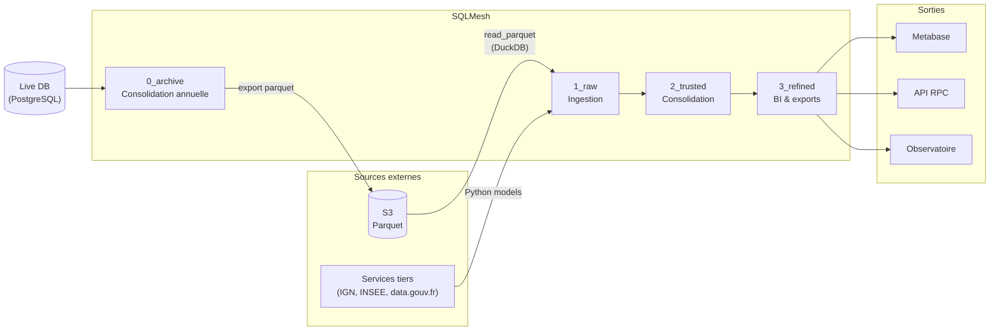

# RPC Data Warehouse

Le Data Warehouse de Preuve de Covoiturage (RPC) est une solution de gestion et d'analyse des données conçue pour stocker, organiser et interroger efficacement les données liées aux activités de covoiturage. Il utilise SQLMesh, un framework de gestion de modèles SQL, pour structurer et orchestrer les transformations de données.

- [Documentation de SQLMesh](https://sqlmesh.readthedocs.io/en/stable/)

## Installation

SQLMesh est une librairie Python. Elle nécessite un environnement virtuel (venv) et l'installation de quelques dépendances.

Le shell Nix à la racine du monorepo configure et active l'environnement virtuel automatiquement. Les dépendances sont installées automatiquement avec `uv`.

```shell
nix develop
(nix-shell) cd ./sqlmesh
```

**Installation manuelle**

Prérequis : installer [Python](https://www.python.org/downloads/) et [uv](https://docs.astral.sh/uv/).

```shell
cd ./sqlmesh
uv venv
uv sync
```

## Configuration

Copier `.env.example` et modifier le fichier `.env`.

```shell
cp .env.example .env
```

## Architecture en zones

Les données sont organisées en 4 zones. Les modèles SQL sont définis dans `models/`, chaque zone dans son propre sous-dossier. L'organisation des dossiers n'influe pas sur les dépendances entre modèles, qui sont définies dans chacun d'eux.

### Cycle de la donnée



### 0_archive — Consolidation & backup

- Lit uniquement les tables live (PostgreSQL, gateway par défaut)
- Compile les données par année (`INCREMENTAL_BY_TIME_RANGE`)
- Exporte au format parquet sur S3 (modèles Python `FULL`)
- **Aucun lien direct** vers les autres zones — le pipeline repart des fichiers S3

### 1_raw — Ingestion

- Charge les données **externes** (IGN, INSEE, data.gouv.fr…) via des modèles Python
- Charge les données RPC depuis les **fichiers parquet sur S3** (gateway `duckdb`, `read_parquet()`)
- **Aucun lien vers 0_archive** — les parquets S3 sont traités comme une source externe
- Pas de jointures complexes : trajets, incitations, données géo sont ingérés séparément
- Crée les index nécessaires aux jointures des zones suivantes

### 2_trusted — Consolidation

- Source de vérité pour l'ensemble du pipeline
- Effectue les jointures d'enrichissement (géo, politiques, opérateurs…)
- Crée les index pour l'exploitation
- Gateway postgres (défaut)

### 3_refined — BI & exports

- Modèles de sortie : Metabase, exports API, observatoire
- Données pré-agrégées pour les besoins métier
- Se base **uniquement sur 2_trusted**
- Gateway postgres (défaut)

## Misc.

### Nommage des fichiers

Le nom du fichier doit correspondre exactement au nom du modèle défini dans le bloc `MODEL`. SQLMesh utilise ce nom pour résoudre les dépendances entre modèles — une incohérence provoque des erreurs silencieuses.

```
models/2_trusted_zone/journeys/journeys_2024.sql  →  name trusted_zone.journeys_2024
models/1_raw_zone/cee/cee_applications.sql        →  name raw_zone.cee_applications
```

Le préfixe numérique du dossier (`1_raw_zone/`) est une convention de lisibilité uniquement : il n'est pas reflété dans le nom du modèle.

### Macros

Les macros Jinja sont définies dans `macros/` et invoquées dans les modèles avec la syntaxe `{{ macro_name(...) }}` à l'intérieur d'un bloc `JINJA_QUERY_BEGIN` / `JINJA_END`.

```sql
JINJA_QUERY_BEGIN;
{{ trusted_journeys_model_generator("raw_zone.journeys_2024", "@start_ts", "@end_ts") }}
JINJA_END;
```

Les macros SQLMesh natives (préfixées `@`) s'utilisent directement hors de tout bloc Jinja :

```sql
@create_index(@this_model, _id, 'name=journeys_2024_id_index');
```

Macros disponibles dans `macros/` :

| Macro | Usage |
|-------|-------|
| `journeys_model_generator(start_ts, end_ts)` | Génère le SELECT de base depuis `carpool_v2` (archive + raw latest) |
| `trusted_journeys_model_generator(source, start_ts, end_ts)` | Transformations et enrichissements pour trusted_zone |
| `get_timezoned_timestamp(geo_code, ts)` | Convertit un timestamp UTC en heure locale selon le code geo |
| `get_final_acquisition_status_list()` | Retourne la liste des statuts d'acquisition finaux |

### Index

Utiliser systématiquement la macro `@create_index()` plutôt qu'un `CREATE INDEX` SQL brut. La macro gère l'idempotence et s'intègre dans le cycle de vie SQLMesh (elle s'exécute après chaque batch incrémental).

```sql
-- ✅ À faire
@create_index(@this_model, _id, 'name=journeys_2024_id_index');
@create_index(@this_model, start_datetime_tz, 'name=journeys_2024_start_datetime_tz_index');

-- ❌ À éviter
CREATE INDEX IF NOT EXISTS ... ON trusted_zone.journeys_2024 (_id);
```

`@this_model` est une référence automatique au modèle courant, qui tient compte de l'environnement (`dev`, `prod`…).

### Organisation par année + latest + vue

Les données volumineuses (trajets, incitations) sont partitionnées par année pour limiter la taille des batches et permettre les backfills ciblés. Le modèle `_latest` couvre la fenêtre glissante de l'année courante et est alimenté en continu depuis la base live.

```
journeys_2020.sql   →  INCREMENTAL_BY_TIME_RANGE  start='2020-01-01 00:00:00+0100' end='2020-12-31 23:59:59+0100'
journeys_2021.sql   →  INCREMENTAL_BY_TIME_RANGE  start='2021-01-01 00:00:00+0100' end='2021-12-31 23:59:59+0100'
...
journeys_latest.sql →  INCREMENTAL_BY_TIME_RANGE  start='2026-01-01 00:00:00+0100' (sans end)
journeys.sql        →  VIEW  — UNION ALL de tous les modèles annuels + latest
```

La vue agrégée (`journeys.sql`) est le point d'entrée standard pour les zones suivantes. Elle ne contient aucune transformation.

### Timezones et variables de batch

SQLMesh expose deux familles de variables pour les bornes temporelles des batches incrémentaux :

| Variable | Type | Exemple |
|----------|------|---------|
| `@start_ds` / `@end_ds` | Date (string) sans heure ni timezone | `'2024-03-15'` |
| `@start_ts` / `@end_ts` | Timestamp avec timezone, dérivé des propriétés `start`/`end` du modèle | `'2024-03-15 00:00:00+0100'` |

**Toujours utiliser `@start_ts` / `@end_ts`** pour filtrer les données horodatées. Les variables `_ds` tronquent l'heure à minuit UTC, ce qui provoque un saut d'un jour sur les données stockées en heure de Paris.

Pour que `@start_ts`/`@end_ts` produisent des bornes à minuit heure de Paris, les propriétés `start` et `end` du modèle doivent inclure l'offset explicitement :

```sql
MODEL (
  name trusted_zone.journeys_2024,
  kind INCREMENTAL_BY_TIME_RANGE (time_column start_datetime, batch_size 30),
  start '2024-01-01 00:00:00+0100',  -- minuit heure de Paris (hiver)
  end   '2024-12-31 23:59:59+0100',
  ...
);
```

L'heure légale française est `+0100` en hiver (CET) et `+0200` en été (CEST). Pour les bornes annuelles (1er janvier, 31 décembre), utiliser `+0100`. SQLMesh traduit ensuite ces timestamps en UTC en interne lors du calcul des batches.

### Audits

Les audits vérifient l'intégrité des données après chaque run. Ils sont définis dans `audits/` et référencés dans les modèles via la propriété `audits`.

Un audit retourne les lignes en anomalie — s'il retourne zéro lignes, l'audit passe. L'option `blocking false` permet de signaler les anomalies sans interrompre le pipeline.

```sql
-- audits/campaigns/incentives.sql
AUDIT (
  name assert_campaign_incentives_complete,
  blocking false
);

SELECT pi._id
FROM policy.incentives pi
WHERE pi.datetime BETWEEN @start_ts AND @end_ts
  AND NOT EXISTS (
    SELECT 1 FROM @this_model ci WHERE ci._id = pi._id
  );
```

Référencer l'audit dans le modèle :

```sql
MODEL (
  name raw_zone.campaign_incentives_2024,
  audits [assert_campaign_incentives_complete],
  ...
);
```

### Commandes utiles

Les exemples suivants utilisent l'environnement de développement `dev`.

```shell
# Analyser les modifications apportées aux modèles SQL
$ sqlmesh plan dev
```

```shell
# Appliquer les modifications planifiées automatiquement
$ sqlmesh plan dev --auto-apply
```

```shell
# Executer une requête sur les données d'un modèle spécifique
$ sqlmesh fetchdf "SELECT * <zone>[__<env>].<table>"
```

> On suffixe `<zone>` par `__` + l'environnement s'il est différent de `prod`.

Exemples :

```shell
sqlmesh fetchdf "SELECT * FROM raw_zone__dev.aires_covoiturage"
sqlmesh fetchdf "SELECT * FROM refined_zone.part_campaigns_by_month"
```
